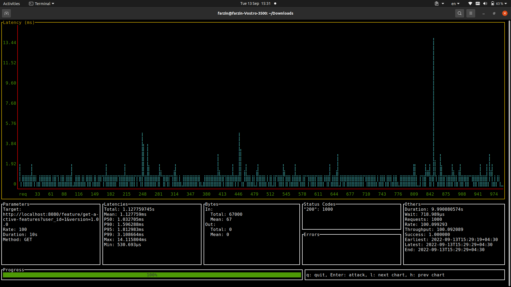
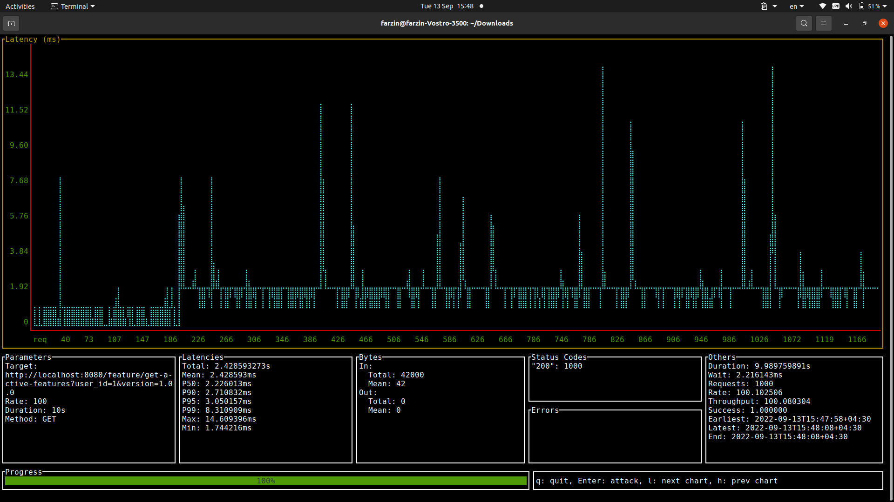
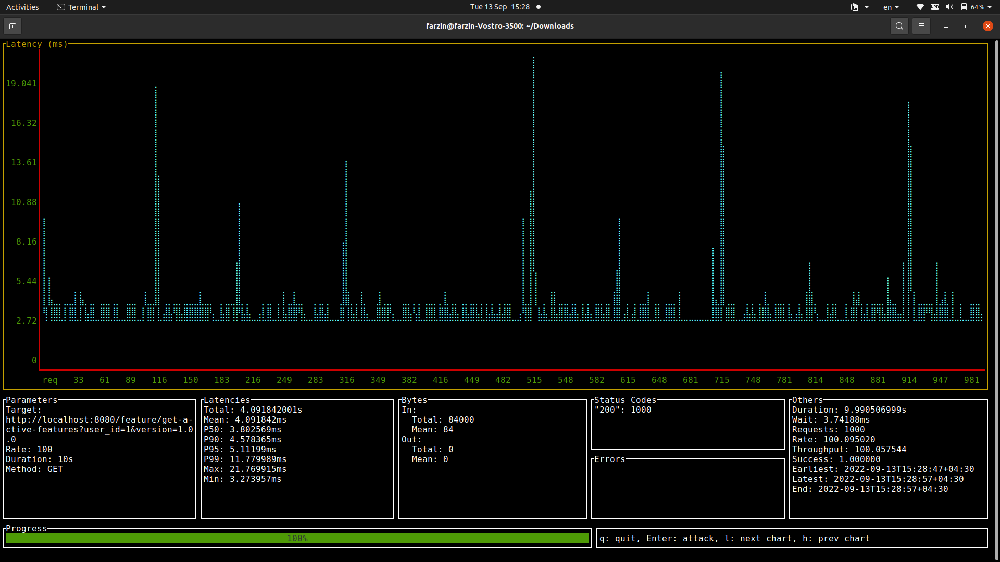
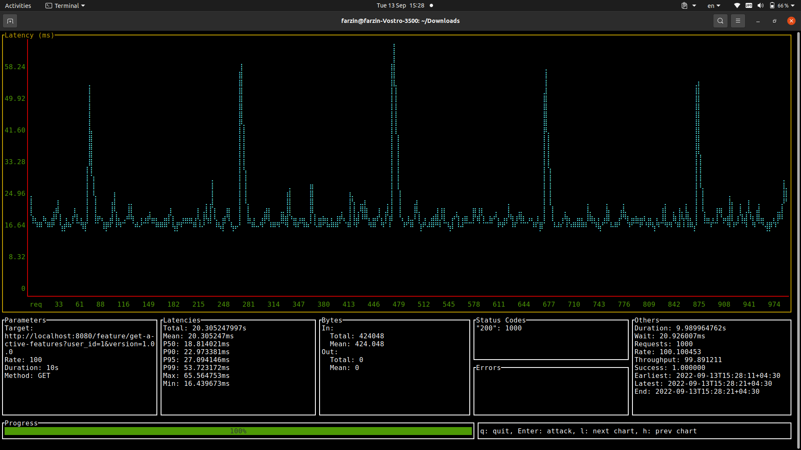
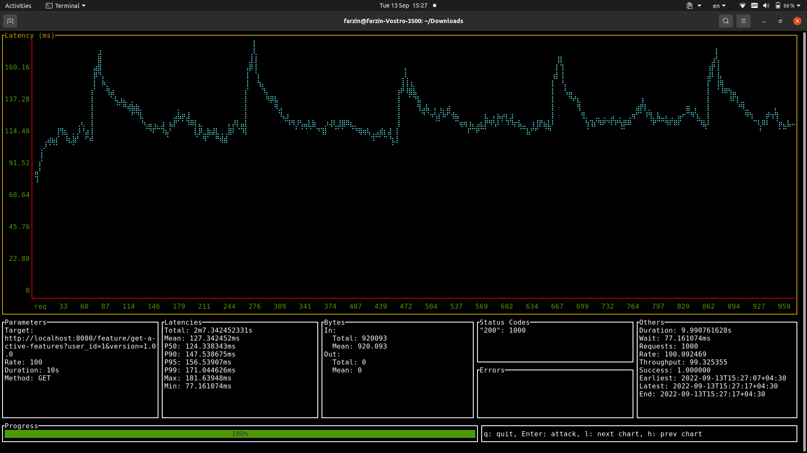
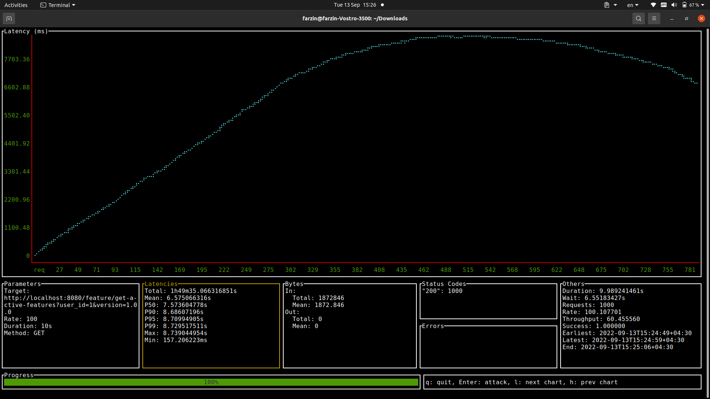

# Feature Flag

## Overview
This an implementation of the [Feature Flag Platform](https://github.com/AliKarami/interview-tasks/blob/master/feature-flag/README.md)
Task. I used `Golang` as my language of choice. 

### Architecture
The layout of this project is structured as a typical standard `Go` project. Internally I use `CQRS` as the main 
architectural pattern for handling requests. You can also spot other patterns and principles such a the `Repository Pattern`
or `Dependency Injection`. My end goal was to reach a balance between *cohesion* and *coupling* both in the component 
and object level, so I tried to use different techniques to reach this goal. 

In more details, the whole system is modeled based on a couple of entities: `version`,`user`,`rule`,`feature`. Some of them 
are mostly value objects(containing minimum logic) while some others are full entities and even aggregates(in case of `feature`).
Although these entities exist in the code, they are mostly limited to domain of the application. For the sake of 
decreasing the level coupling, I used DTOs and other type of data holder in many places where it fit. This action violets the DRY 
principle but the code becomes much more loosely coupled.

I used the [wire](https://github.com/google/wire) tool to manage dependencies at compile time. 

Finally, I tried to adhere to clean code principles, and I hope the code is clean enough for the reader of this document!

### Implementation
There are a couple of details I want to point out about the implementation. First, my mindset towards this project
was to deliver a working system with a solid architectural foundation and ready for future developments, and at the same time
delivering a good enough performance. Consequently, this system can not handle very high loads of requests but as you can 
find out in the `Benchmark` section, it can perform well enough under reasonable loads. However here some things I wanted to 
do but didn't have time to increase scalability and performance:

* using libraries like [fast-http](https://github.com/valyala/fasthttp) or [grpc](https://grpc.io/) to increase speed on reduce packet size
* using a multi-threaded model 
* introducing some dirty code!(less object mapping and data holders and more use of pointers/mutations)

Also in production environments, a redis cluster can really help! Furthermore,
techniques like sharding can improve scalability
(each instance of this program only serves a portion of userIds)

#### Data model
In this project, redis serves as the main database. My initial plan was to use a regular RDMS and use redis as the 
cache in front of the db, However it was time-consuming and would not have many benefits for the system since redis 
also has a `persistant mode` that flushes the memory on to the disk in some intervals and for my uses cases, this was enough.

Every feature(with its rules) is kept as a key-value pair in redis. Now to find out which features are active for a user, there are two methods:

1. Keep a record of features flags for each user. Update the record whenever a new feature is created, or an old feature rule
is updated or a feature is deleted.

2. Keep a record of features flags for each user. Update the record whenever a Get request is called.

Method 1 is more complex to implement, specially in a key-value store like redis, because in order to be efficient
we have keep track of the mapping between each feature and user which can be more easily achieved in the *Relational model*
. Moreover, when a new feature is created all users have to be checked and all records have to update. Since the order
of users is much higher than the order of features, this is not a good solution.

So I decided to use method 2, consequently, the system is not in a consistent state at any moment of time. The record 
of available features becomes consistent only when a call is made to the API. This has the overhead of computing the new records
each time but this can be mitigated with the methods I mentioned above.

## Rules
There are four kinds of feature flag rules
1. Global (which is 100% on/off for all users)
2. Partial (which specifies the percentage of users this feature should be enabled for)
3. Minimum version (which specifies a minimum app version that this feature should be enabled on)
4. Combination of rules 2 and 3

These rules are handled by the following policies in my implementation:

* A Global rule is just a partial rule with `100%` coverage
* Although you can update the values of a previously created rule, you can not convert a rule from one type to another
* You can not update the value of a Partial rule to anything less than its old value
* A partial rule is evaluated the first time a user asks for its active features, either the feature is given to the user
or not, in either way, this evaluation sticks with the user unless the new rule covers more users.

## Test
You can use the `Postman Collection` I've put beside the project files, or you can use the following api calls:

```shell
# Create a feature with combined rule
curl --location --request POST 'localhost:8080/feature/create' \
--header 'Content-Type: application/json' \
--data-raw '{
    "name": "a",
    "coverage": 0.5,
    "min_version" : "1.0.0"
}'

# Create a feature with partial rule
curl --location --request POST 'localhost:8080/feature/create' \
--header 'Content-Type: application/json' \
--data-raw '{
    "name": "a",
    "coverage": 0.5,
}'

# Create a feature with version rule
curl --location --request POST 'localhost:8080/feature/create' \
--header 'Content-Type: application/json' \
--data-raw '{
    "name": "a",
    "coverage": 0.5,
    "min_version" : "1.0.0"
}'

# Create a feature with global rule
curl --location --request POST 'localhost:8080/feature/create' \
--header 'Content-Type: application/json' \
--data-raw '{
    "name": "a",
    "coverage": 1
}'

# Update a feature
curl --location --request POST 'localhost:8080/feature/update' \
--header 'Content-Type: application/json' \
--data-raw '{
    "name": "a",
    "coverage": 0.5,
    "min_version" : "1.2.0"
}'

# Delete a feature
curl --location --request POST 'localhost:8080/feature/delete' \
--header 'Content-Type: application/json' \
--data-raw '{
    "name": "a"
}'

# Get a feature
curl --location --request GET 'localhost:8080/feature/get?name=a' \
--data-raw ''

# Get active features (for a specific user)
curl --location --request GET 'localhost:8080/feature/get-active-features?user_id=2&version=1.9.9' \
--data-raw ''
```


## Deployment

```shell
# cd to the working directory of the project
make dependencies # to download dependencies
make build # to build a binary output of the project
docker build -t featureflag .
docker run --rm featureflag # to run the image independently
docker-compose up 
```
Also, you can independently run the binary without docker and use `docker-compose up redis` to only deploy redis.

*ideally the Dockerfile should take care of compiling the codebase and running it inside the container
,however, due to international sanctions and poor internet! I wasn't able to do that, so instead the Dockerfile just 
copies the already created binary and runs it. Please keep in mind that you might need to change the platform from
`FROM ubuntu:20.04` to the specs of your own machine for this to work.

## Benchmarks

I benchmarked to programme to see how it behaves under high loads of requests. The only important api that we're
concerned about is then one that gets the `user_id` and `version` and returns the list of active feature flags:

```
http://{url}/feature/get-active-features?user_id={userId}&version={version}'
```

Test Machine:
* 8 core intel 11th gen CPU
* 16GB RAM
* localhost 

Test Configs:
* 100 req/s
* 10s duration of each run

Test Criteria:
* n : number of features
* partial feature with coverage of 5%

### Test Results

**For n = 10**

**For n = 50**

**For n = 100**

**For n = 500**

**For n = 1000**

**For n = 2000**



#### Plots

**For n <= 500**
.jpeg)

**For n <= 2000**
.jpeg)


##### Resources
I used [this](https://github.com/nakabonne/ali) tool to get the benchmarks with the following command:

```shell
ali --rate=100 --duration=10s --method=GET 'http://localhost:8080/feature/get-active-features?user_id=1&version=1.0.0'
```

To add features:

```shell
for n in {1..100}; do curl -X POST -H "Content-Type: application/json"  -d '{"name": "'"$n"'", "coverage": 0.05}' localhost:8080/feature/create; done;
```

## Other Nodes
The project does not contain proper error handling and logging mechanism which is required in real-life production
code. Also, the code mostly does not any kinds of automated tests except [user_test.go](./internal/app/featureflag/feature/entity/user_test.go). 
I did not implement these because they seemed unnecessary for this task based what I was tolled by the interviewers.